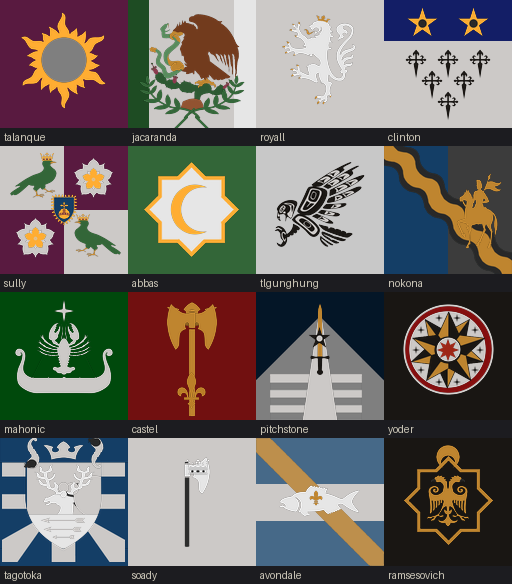

# ATE Scoreboard

A standalone addon for **[After the End](https://steamcommunity.com/sharedfiles/filedetails/?id=3192256710)** (Crusader Kings III) that brings back CK2's end-game legacy scoreboard.

When your dynasty's run ends, a **Legacy Scoreboard** button appears on the game-over screen. It opens a panel ranking your house against sixteen great houses of the post-Event world — each with its real coat of arms, its title, and its history on hover.



*The sixteen houses of the ladder — every coat of arms generated from After the End's own definitions.*

## What it shows

- **Your score**, beside your own dynasty's arms
- **The house you surpassed**, with a short account of who they were
- **The full ladder** — sixteen rungs, those you beat picked out in gold, those beyond your reach greyed

## How the score works

CK3's renown is a *currency*: it drops every time you buy a dynasty legacy perk, so ranking on the raw number punishes players who actually spent it well. This mod reconstructs lifetime renown instead.

CK3 prices each perk at `250 + 500n` (`PERK_COST_BASE` / `PERK_COST_MULTIPLIER` in `00_defines.txt`). Summing that series gives a closed form, so the total ever spent on N perks is exactly `250 * N^2`:

```
score = current renown + 250 * perks^2
```

That maps neatly onto the original CK2 thresholds, which are used unchanged — 2 perks reaches the bottom rung, 20 perks the summit.

## Installation

Requires **After the End**. Copy `Ck3ATEScoreBoard` into your CK3 `mod` folder alongside a matching `.mod` descriptor, and enable it **after** ATE in your playset.

## Regenerating the coats of arms

The sixteen CoA images are generated from ATE's own definitions rather than screenshotted:

```bash
python scripts/render_coas.py --size 128
```

The script parses each house's CoA block, resolves named colours, and composites pattern and emblems the way CK3 does. Two engine behaviours it has to account for, both established by rendering and inspecting the output:

- **`depth` is inverted** — a higher `depth` draws *further back*.
- **Patterns and emblems encode colour differently.** Patterns mask colour slots in RGB; emblems are alpha silhouettes carrying a constant `B ≈ 128` baseline that must *not* be treated as a colour-3 mask.

Three houses (Jacaranda, Nokona, Yoder) have no dynasty coat of arms anywhere in ATE, so they display the arms of the realm they ruled.

## Notes

- `scripts/plan.md` documents the design, the CK3 GUI constraints that shaped it, and the remaining optional polish.
- `scripts/ck2_ate_scoreboard.md` and `scripts/ck2_vanilla_scoreboard.md` hold the original CK2 boards this is based on.
- Coat-of-arms artwork is generated from After the End's own definitions and belongs to that mod's authors.
